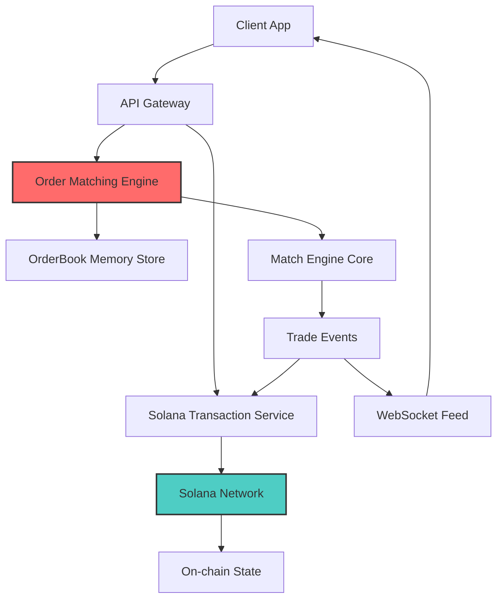
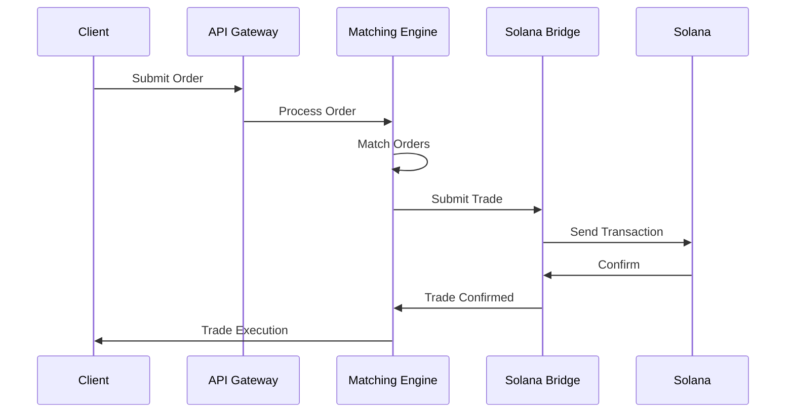
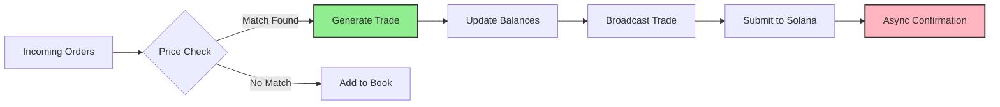
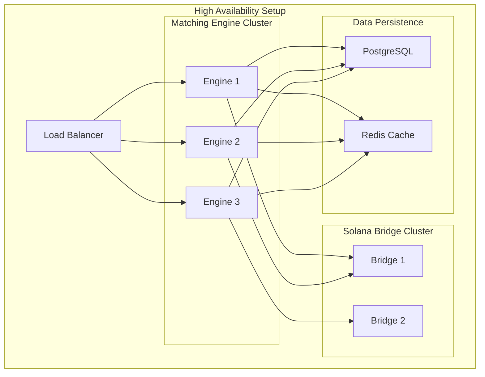

# 🏗️ HYBRID ORDERBOOK + SOLANA ARCHITECTURE

## 📋 ОБЗОР

**Концепция:** Централизованный OrderBook для максимальной скорости + Solana для decentralized settlement

**Почему Hybrid:**
- ⚡ ** microseconds** latency для matching
- 🔗 **Blockchain immutability** для execution
- 💰 **Low fees** vs fully on-chain
- 🛡️ **Censorship resistant** settlement

---

## 🏛️ АРХИТЕКТУРА



---

## 🔧 КОМПОНЕНТЫ

### 1. 🏃 ORDER MATCHING ENGINE
```go
type MatchingEngine struct {
    OrderBook    *OrderBook
    TradeFeed    chan Trade
    BalanceStore map[string]Decimal
    SolanaBridge *SolanaBridge
}

func (me *MatchingEngine) ProcessOrder(order Order) {
    match := me.OrderBook.Match(order)
    if match.Trade != nil {
        me.ProcessTrade(match.Trade)
    }
}

func (me *MatchingEngine) ProcessTrade(trade Trade) {
    // Обновление балансов
    me.UpdateBalances(trade)
    
    // Отправка в Solana
    go me.SolanaBridge.SubmitTrade(trade)
    
    // Broadcast
    me.TradeFeed <- trade
}
```

### 2. 🌉 SOLANA BRIDGE
```go
type SolanaBridge struct {
    Client     *rpc.Client
    ProgramID  solana.PublicKey
    Signer     *solana.Account
}

type TradeTransaction struct {
    Instruction  solana.CompiledInstruction
    TradeID      string
    Taker        solana.PublicKey
    Maker        solana.PublicKey
    Amount       uint64
    Price        uint64
    Timestamp    int64
}

func (sb *SolanaBridge) SubmitTrade(trade Trade) error {
    // Создание instruction
    instruction := sb.CreateTradeInstruction(trade)
    
    // Build transaction
    tx, err := transaction.NewTransaction(
        sb.Signer.PublicKey(),
        []solana.CompiledInstruction{instruction},
        transaction.MaxComputeBudgetLimit,
    )
    
    // Sign and send
    tx.Sign(sb.Signer.PrivateKey)
    sig, err := sb.Client.SendTransaction(context.Background(), tx)
    
    return sb.WaitForConfirmation(sig)
}
```

### 3. 📊 ORDERBOOK CORE
```go
type OrderBook struct {
    Bids map[float64]*PriceLevel  // Price -> [Orders]
    Asks map[float64]*PriceLevel
    
    bidPrices []float64  // Sorted desc
    askPrices []float64  // Sorted asc
    
    mu sync.RWMutex
}

type Order struct {
    ID       string
    Side     Side
    Amount   decimal.Decimal
    Price    decimal.Decimal
    User     string
    Created  time.Time
}

func (ob *OrderBook) Match(order Order) MatchResult {
    ob.mu.Lock()
    defer ob.mu.Unlock()
    
    if order.Side == BUY {
        return ob.matchBid(order)
    }
    return ob.matchAsk(order)
}
```

---

## 🔄 FLOW ПРОЦЕССОВ

### 1. 📥 ORDER SUBMISSION


### 2. ⚡ HIGH FREQUENCY MATCHING


---

## 🎛️ SOLANA PROGRAM STRUCTURE

### Account Layout
```rust
#[account]
pub struct TradeState {
    pub trade_id: String,
    pub maker: Pubkey,
    pub taker: Pubkey,
    pub amount: u64,
    pub price: u64,
    pub timestamp: i64,
    pub status: TradeStatus,
}

#[derive(Debug, Clone, AnchorSerialize, AnchorDeserialize)]
pub enum TradeStatus {
    Pending,
    Confirmed,
    Reverted,
}
```

### Instruction Handlers
```rust
#[derive(Accounts)]
pub struct ExecuteTrade<'info> {
    #[account(mut)]
    pub authority: Signer<'info>,
    #[account(
        init_if_needed,
        payer = authority,
        space = 8 + TradeState::INIT_SPACE
    )]
    pub trade_state: Account<'info, TradeState>,
    pub system_program: Program<'info, System>,
}

pub fn execute_trade(
    ctx: Context<ExecuteTrade>,
    trade_data: TradeData,
) -> Result<()> {
    let trade_state = &mut ctx.accounts.trade_state;
    
    trade_state.trade_id = trade_data.trade_id;
    trade_state.maker = trade_data.maker;
    trade_state.taker = trade_data.taker;
    trade_state.amount = trade_data.amount;
    trade_state.price = trade_data.price;
    trade_state.timestamp = Clock::get()?.unix_timestamp;
    trade_state.status = TradeStatus::Confirmed;
    
    Ok(())
}
```

---

## 📈 PERFORMANCE OPTIMIZATIONS

### 1. 🚀 MEMORY POOLS
```go
type OrderPool struct {
    pool []Order
    pos  int
    mu   sync.Mutex
}

func (op *OrderPool) Get() *Order {
    op.mu.Lock()
    defer op.mu.Unlock()
    
    if op.pos >= len(op.pool) {
        op.pool = append(op.pool, Order{})
    }
    
    order := &op.pool[op.pos]
    op.pos++
    return order
}

func (op *OrderPool) Return(order *Order) {
    op.mu.Lock()
    defer op.mu.Unlock()
    
    // Reset order
    *order = Order{}
    op.pos--
}
```

### 2. ⚡ ASYNC SOLANA BATCHING
```go
type SolanaBatcher struct {
    transactions []TradeTransaction
    batchSize    int
    ticker       *time.Ticker
    bridge       *SolanaBridge
}

func (sb *SolanaBatcher) Start() {
    go func() {
        for range sb.ticker.C {
            sb.flushBatch()
        }
    }()
}

func (sb *SolanaBatcher) AddTransaction(tx TradeTransaction) {
    sb.transactions = append(sb.transactions, tx)
    if len(sb.transactions) >= sb.batchSize {
        sb.flushBatch()
    }
}

func (sb *SolanaBatcher) flushBatch() {
    if len(sb.transactions) == 0 {
        return
    }
    
    // Batch submit to Solana
    sb.bridge.SubmitBatch(sb.transactions)
    sb.transactions = sb.transactions[:0]
}
```

---

## 🛡️ SECURITY & RISK MANAGEMENT

### 1. 💰 BALANCE VALIDATION
```go
func (me *MatchingEngine) ValidateOrder(order Order) error {
    balance, exists := me.BalanceStore[order.User]
    if !exists {
        return errors.New("user balance not found")
    }
    
    if order.Side == BUY {
        required := order.Amount.Mul(order.Price)
        if balance.LessThan(required) {
            return errors.New("insufficient balance")
        }
    } else {
        // Check for SELL orders
        if balance.LessThan(order.Amount) {
            return errors.New("insufficient balance")
        }
    }
    
    return nil
}
```

### 2. 🔄 SOLANA FAILURE HANDLING
```go
func (sb *SolanaBridge) SubmitTradeWithRetry(trade Trade, maxRetries int) error {
    for i := 0; i < maxRetries; i++ {
        err := sb.SubmitTrade(trade)
        if err == nil {
            return nil
        }
        
        // Exponential backoff
        backoff := time.Duration(1<<uint(i)) * time.Second
        time.Sleep(backoff)
        
        // Log retry
        log.Printf("Retry %d for trade %s: %v", i+1, trade.ID, err)
    }
    
    return fmt.Errorf("failed after %d retries", maxRetries)
}
```

---

## 📊 METRICS & MONITORING

### Key Performance Indicators
- **Latency:** < 100 microseconds order matching
- **Throughput:** 100,000+ orders/second
- **Solana Success Rate:** > 99.5%
- **System Uptime:** 99.9%

### Monitoring Stack
```go
type Metrics struct {
    OrdersPerSecond prometheus.Counter
    TradeLatency    prometheus.Histogram
    SolanaErrors    prometheus.Counter
    SystemLoad      prometheus.Gauge
}

func (m *Metrics) RecordOrder() {
    m.OrdersPerSecond.Inc()
}

func (m *Metrics) RecordLatency(duration time.Duration) {
    m.TradeLatency.Observe(duration.Seconds())
}
```

---

## 🚀 DEPLOYMENT ARCHITECTURE



---

## 🎯 IMPLEMENTATION ROADMAP

### Phase 1: MVP (2-3 недели)
- [x] Basic OrderBook implementation
- [x] Simple matching logic
- [x] WebSocket trade feed
- [ ] Basic Solana bridge

### Phase 2: Production (4-6 недель)
- [ ] Advanced order types
- [ ] Risk management
- [ ] Performance optimization
- [ ] Full Solana integration

### Phase 3: Scale (6-8 недель)
- [ ] Multi-region deployment
- [ ] Advanced monitoring
- [ ] Load testing
- [ ] Production hardening

---

## 💡 TECHNICAL DECISIONS

| Component | Choice | Reason |
|-----------|--------|--------|
| Matching Engine | Go | Performance, concurrency |
| Database | PostgreSQL | ACID compliance |
| Cache | Redis | Speed, persistence |
| Queue | NATS | Lightweight, fast |
| Monitoring | Prometheus + Grafana | Industry standard |
| Deployment | Kubernetes | Scalability |

---

## 🔄 NEXT STEPS

1. **Setup development environment**
2. **Implement core OrderBook**
3. **Build Solana bridge prototype**
4. **Performance testing**
5. **Security audit**
6. **Production deployment**

---

**📞 Ready to implement?** Start with OrderBook core and gradually add Solana integration!

*Generated by Cody - AI Technical Architecture Assistant* 🚀